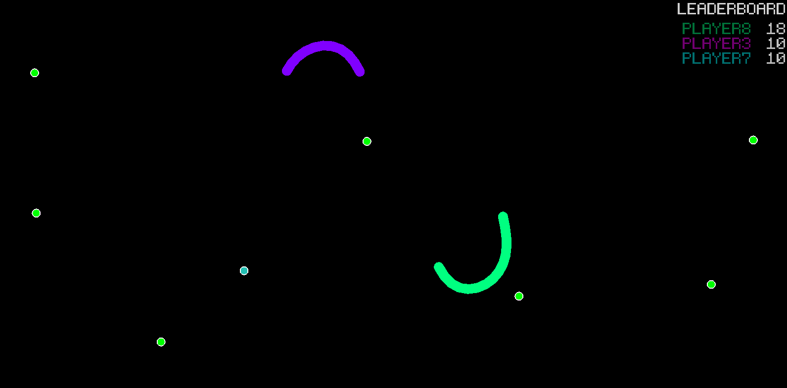

# Snake game

> Local multiplayer snake game with 'analog' movement and powerups, written in C, using OpenGL 1.x
> with GLFW as part of the first semester programming course homework.



## Building and running

Originally was a Visual Studio project and got ported to CMake later.

### Tools

- CMake 3.20
- MSVC 2019

### CMake environment

Create your own CMakeUserPresets.json file that extends the included presets, for example on Windows with Visual Studio:

```json
{
    "version": 2,
    "configurePresets": [
        {
            "name": "user-default",
            "inherits": "vstudio-default",
            "environment": {
                "PATH": "$penv{PATH};<your tool paths>"
            }
        }
    ]
}
```

## Instructions

### Playing

1. Press play
2. Players can join by pressing their attack button
3. Press start to begin the game

In the game there are items that can be picked up, the standard pickup makes the player longer,
others speed up the player, slow down enemy players, inverts enemy controls or makes the player
invincible.

### Configuration

The `config.ini` file should be present in the current working directory.

Window size can be changed and fullscreen mode can be enabled.

```ini
fullscreen=0
width=1600
height=800
```

Each player can be assigned a name and keys or joystick buttons/sticks can be mapped to their
controls. Below is an example which configures 3 players, two using the keyboard's common arrow
and WASD controls, another player is assigned gamepad 0.

More examples are available in [configs/](./configs).

```ini
#settings
fullscreen=0
width=1600
height=800

#Player1
#A, D, S
P1.name=player1
P1.left=65
P1.right=68
P1.attack=83

#Player2
#left arrow, right arrow, right shift
P2.name=player2
P2.left=263
P2.right=262
P2.attack=344

#Player3
#gamepad0 axis0, button2
P3.name=player3
P3.joy=0
P3.axis=0
P3.button=2
```
